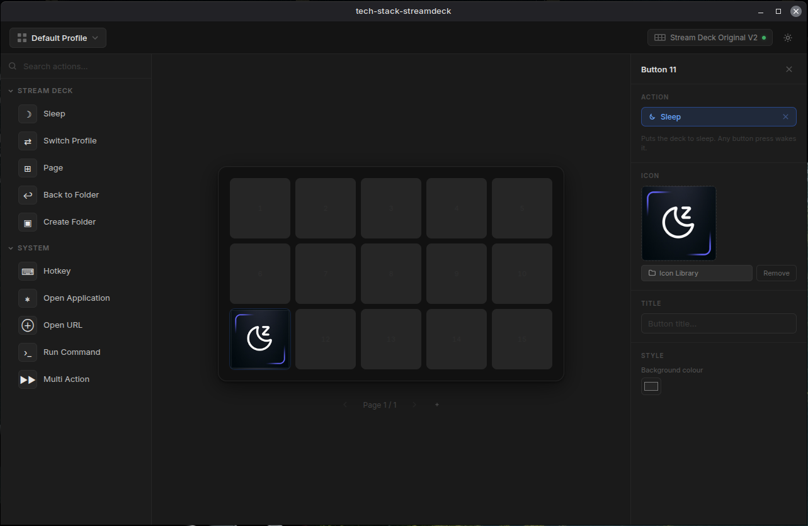

# tech-stack-streamdeck

> **An open-source controller for the Elgato Stream Deck, built for Linux** — powered by Electron, React, and Vite.

[](https://www.linux.org/)
[](https://linuxmint.com/)
[](https://www.electronjs.org/)
[](https://react.dev/)
[](https://nodejs.org/)
[](#licence)

---

The **official Elgato Stream Deck software does not support Linux**. This project fills that gap — a full-featured, dark-themed desktop controller that mirrors the Elgato software's UI and drives the hardware directly over USB without any proprietary drivers or Wine.



> **Platform note:** Developed and tested on **Linux Mint 22.3 (Wilma / Ubuntu 24.04 base)**. Not yet tested on other distributions. See [Gotchas & Known Limitations](#gotchas--known-limitations) before running on a different distro.

---

## Table of Contents

- [Features](#features)
- [Installing OBS Studio & Discord Plugins](#-installing-the-obs-studio--discord-plugins)
- [What It Cannot Do (Yet)](#what-it-cannot-do-yet)
- [Requirements](#requirements)
- [Installation](#installation)
- [Running the App](#running-the-app)
- [USB Permissions (udev)](#usb-permissions-udev)
- [Plugin System](#plugin-system)
- [Gotchas & Known Limitations](#gotchas--known-limitations)
- [Tech Stack](#tech-stack)
- [Project Structure](#project-structure)
- [Roadmap](#roadmap)

---

## Features

### Button Actions
| Action | Description |
|--------|-------------|
| **Hotkey** | Simulates a keypress via `xdotool` (e.g. `ctrl+shift+t`) |
| **Open Application** | Launches an app via `gtk-launch` (`.desktop` ID), `xdg-open`, or a direct binary path. Supports Flatpak. |
| **Open URL** | Opens a URL in your default browser via `xdg-open`. Restricted to `http://`, `https://`, and `ftp://`. |
| **Run Command** | Executes an arbitrary shell command via `bash -c`. |
| **Multi Action** | Chains multiple actions together, executed in sequence on a single button press. |
| **Switch Profile** | Swaps the active profile and redraws the hardware buttons immediately. |
| **Sleep / Wake** | Blanks the Stream Deck display. Any button press wakes it. |
| **Page** | Navigates to a different page within the current profile. |
| **Folder** | Enters a nested page scoped to that button. |
| **Back to Folder** | Returns to the parent page from inside a folder. |

### UI & Profiles
- **Dark theme** matching Elgato's aesthetic.
- **Multiple profiles** — create, rename, switch, and delete named profiles. Each profile is stored as a human-readable JSON file.
- **Multiple pages per profile** — add/remove pages with a page navigator at the bottom.
- **Nested folders** — folders can be nested to arbitrary depth.
- **Drag-and-drop** — drag actions from the left panel directly onto buttons.
- **Right-click context menu** — Clear, Copy, and Paste buttons.
- **Button editor panel** — slides in on click; set title, icon, background colour, and action.
- **Icon Library** — point the app at a local folder of images; browse and assign them to buttons.
- **Animated icons (GIF)** — animated GIFs play on the hardware buttons in real time.
- **System tray** — closing the window hides to tray. The app keeps running in the background.
- **Auto-reconnect** — if the Stream Deck is unplugged, the app polls every 2 seconds and reconnects automatically without requiring a restart.
- **Single-instance lock** — launching a second instance focuses the existing window.

### Hardware
- Pixel-accurate rendering to the Stream Deck LCD buttons (72 × 72 px RGBA).
- Brightness control for sleep/wake.
- Flash feedback on button press (blue circle).

### Built-in Plugins
| Plugin | Actions / modes | Requires |
|--------|----------------|----------|
| **Volume** | Raise, Lower, Mute toggle, Live display (shows % and mute state) | `pactl` |
| **Media Control** | Play/Pause, Next, Previous, Stop, Live track-info display | `playerctl` |
| **Clock / Date** | Live clock on a button with a configurable format string (`HH:MM`, `DD/MM`, etc.) | — |
| **CPU / RAM** | Live CPU% and RAM% display, updating every 2 s | — |

All plugin buttons respect a custom icon or title — if you set one, it overrides the default dynamic display.

### Installable Plugins
OBS Studio and Discord support are distributed as separate `.sdPlugin` packages. Only install the ones you need.

| Plugin | Actions | Requires |
|--------|---------|----------|
| **OBS Studio** (`obs-plugin/`) | Toggle record, toggle stream, pause recording, replay buffer, switch scene, switch collection, source visibility, mute, media control, studio mode, filter toggle, screenshot, transition, chapter marker | OBS WebSocket |
| **Discord** (`discord-plugin/`) | Push-to-Talk, Mute, Deafen | `xdotool` |

---

> [!IMPORTANT]
> ## 🔌 Installing the OBS Studio & Discord Plugins
>
> OBS Studio and Discord support ship as **separate plugin packages** — they are **not active by default**.
> You must copy the plugin folder to the correct location before the app will discover them.
>
> ### Where they live in this repo
>
> ```
> tech-stack-streamdeck/
> ├── obs-plugin/
> │   └── com.obs.streamdeck.sdPlugin/   ← copy this entire folder
> └── discord-plugin/
>     └── com.discord.streamdeck.sdPlugin/  ← copy this entire folder
> ```
>
> ### How to install
>
> ```bash
> # 1. Create the plugins directory (one-time setup)
> mkdir -p ~/.config/tech-stack-streamdeck/plugins
>
> # 2a. Install OBS Studio plugin
> cp -r obs-plugin/com.obs.streamdeck.sdPlugin \
>   ~/.config/tech-stack-streamdeck/plugins/
>
> # 2b. Install Discord plugin
> cp -r discord-plugin/com.discord.streamdeck.sdPlugin \
>   ~/.config/tech-stack-streamdeck/plugins/
> ```
>
> **Restart the app after installing.** Plugin actions appear in the action picker under their own category ("OBS Studio" / "Discord").
>
> ### Plugin prerequisites
>
> | Plugin | Extra setup required |
> |--------|---------------------|
> | **OBS Studio** | Open OBS → **Tools → WebSocket Server Settings** → enable the server (default port **4455**). The plugin auto-connects and retries every 5 s. |
> | **Discord** | Ensure `xdotool` is installed (`sudo apt install xdotool`). Open Discord and configure your Push-to-Talk / Mute / Deafen keys there. |
>
> To uninstall a plugin, delete its folder from `~/.config/tech-stack-streamdeck/plugins/` and restart the app.

---

## What It Cannot Do (Yet)

- **Windows / macOS support** — untested and likely broken (`xdotool`, `xdg-open`, and udev are Linux-specific).
- **Non-Original V2 models** — only the Stream Deck Original V2 (5×3) has been tested. Other models (Mini, XL, MK.2, +) may work but are untested.

---

## Requirements

### Hardware
- Elgato Stream Deck (tested: **Original V2**)

### System
- **Linux Mint 22.3** (Ubuntu 24.04 base) — other distros untested
- **Node.js** v18 or later (v24 recommended; managed via [nvm](https://github.com/nvm-sh/nvm))
- **npm** v9 or later

### External CLI Tools

These must be installed and available on your `$PATH`:

| Tool | Purpose | Install |
|------|---------|---------|
| `xdotool` | Hotkey simulation | `sudo apt install xdotool` |
| `xdg-open` | Open URLs and applications | Pre-installed on most desktop distros |
| `gtk-launch` | Launch `.desktop` apps by ID | Pre-installed with GTK (standard on GNOME/Cinnamon) |
| `pactl` | Volume control (PulseAudio / PipeWire) | `sudo apt install pulseaudio-utils` (usually pre-installed) |
| `playerctl` | Media control via MPRIS | `sudo apt install playerctl` |

> **Note:** If `xdotool` or `playerctl` are not installed, their respective actions will silently do nothing. `pactl` is included with most PulseAudio/PipeWire desktop setups.

---

## Plugin System

Plugins are `.sdPlugin` packages that the app discovers from `~/.config/tech-stack-streamdeck/plugins/`. Only install the plugins you actually need.

### Installing a plugin

```bash
# Create the plugins directory if it doesn't exist
mkdir -p ~/.config/tech-stack-streamdeck/plugins

# Copy the desired plugin folder (example: OBS Studio)
cp -r obs-plugin/com.obs.streamdeck.sdPlugin \
  ~/.config/tech-stack-streamdeck/plugins/

# Or for Discord:
cp -r discord-plugin/com.discord.streamdeck.sdPlugin \
  ~/.config/tech-stack-streamdeck/plugins/
```

Restart the app after installing a plugin. Installed plugin actions appear in the action picker under their own category.

To uninstall, open the Plugin Browser in the app (toolbar icon) or delete the plugin folder from `~/.config/tech-stack-streamdeck/plugins/` and restart.

---

### Built-in plugin setup

#### Volume (`pactl`)
No setup needed beyond having `pactl` installed. Buttons target `@DEFAULT_SINK@` by default, which follows your system default audio output. You can override the sink name in the button settings.

#### Media Control (`playerctl`)
Install `playerctl` and ensure your media player exposes an MPRIS D-Bus interface (most Linux players do: Spotify, Firefox, VLC, Rhythmbox, etc.).

```bash
sudo apt install playerctl

# Verify a player is visible:
playerctl -l
```

Buttons can target a specific player name or use `%any` (default) to control whatever is currently active.

---

### OBS Studio plugin

1. Install the plugin (see [Installing a plugin](#installing-a-plugin) above)
2. Open OBS → **Tools → WebSocket Server Settings**
3. Enable the WebSocket server (default port **4455**, no password required by default)
4. Assign OBS actions to buttons — the plugin connects to OBS automatically and retries every 5 s if OBS is not running

The Scene, Scene Collection, Source, Input, and Transition pickers in the Property Inspector are populated live from OBS once connected.

### Discord plugin

1. Install the plugin (see [Installing a plugin](#installing-a-plugin) above)
2. Ensure `xdotool` is installed (`sudo apt install xdotool`)
3. Open Discord and assign Push-to-Talk / Mute / Deafen to buttons

---

## Installation

### Installing from the pre-built package (recommended)

Download the latest `.deb` from the [Releases page](https://github.com/FritzBlignaut/tech-stack-streamdeck/releases).

### Building from source (developers)

```bash
# 1. Clone the repo
git clone https://github.com/your-username/tech-stack-streamdeck.git
cd tech-stack-streamdeck

# 2. Install system build dependencies (required to compile node-hid)
sudo apt install libudev-dev libusb-1.0-0-dev build-essential

# 3. Install Node dependencies
npm install

# 4. Rebuild native modules for Electron
npm run rebuild

# 5. Build the renderer
npm run build
```

> **Step 2 is required.** `node-hid` compiles a native binding (`binding.gyp`) that links against `libudev`. Without the `-dev` headers the build fails with `fatal error: libudev.h: No such file or directory`.

> **Step 4 is mandatory.** `node-hid` must be compiled against the specific version of Electron you are using. Skipping this step will result in a "Could not load module" error on startup.

### libudev version conflict (Ubuntu 24.04 / Mint 22.x)

If `sudo apt install libudev-dev` fails with _"has unmet dependencies — libudev1 (= x.y) but x.z is to be installed"_, your installed `libudev1` is newer than what the package index offers. Workaround — extract only the header and linker symlink without touching the runtime:

```bash
cd /tmp
apt-get download libudev-dev
dpkg -x libudev-dev_*.deb libudev-extracted
sudo cp libudev-extracted/usr/include/libudev.h /usr/local/include/
sudo ln -sf /usr/lib/x86_64-linux-gnu/libudev.so.1 /usr/local/lib/libudev.so
rm -rf libudev-extracted libudev-dev_*.deb
```

This is a one-time setup. The build toolchain finds the header and symlink in `/usr/local/` without downgrading any system packages.

---

## Running the App

```bash
# Dev mode — hot-reloading renderer + Electron (run in two separate terminals)
npm run dev           # terminal 1: starts the Vite dev server
npm run electron:dev  # terminal 2: starts Electron pointed at the dev server
```

### Testing the packaged build locally

Before pushing to `develop` and waiting for CI, you can test the exact same behaviour as the installed `.deb` directly on your machine:

```bash
npm run test:local
```

This runs `vite build` followed by `electron-builder --linux dir`, which produces an unpacked binary at `dist-electron/linux-unpacked/` and immediately launches it. Unlike dev mode, this sets `app.isPackaged = true`, loads assets via `file://`, runs the asar-packed bundle, and rebuilds native modules for the target Electron version — identical to what gets installed from the `.deb`.

If you only want to build without launching:

```bash
npm run package:local
./dist-electron/linux-unpacked/tech-stack-streamdeck
```

Add `--no-sandbox` if Electron complains about sandboxing on your system.

---

## USB Permissions (udev)

On Linux, USB HID devices are not accessible by regular users by default. A udev rule is required to grant access without `sudo`.

**1. Create the rule file:**

```bash
sudo nano /etc/udev/rules.d/50-elgato.rules
```

**2. Add the following line and save:**

```
SUBSYSTEM=="hidraw", ATTRS{idVendor}=="0fd9", TAG+="uaccess"
```

**3. Reload udev and replug the device:**

```bash
sudo udevadm control --reload-rules
sudo udevadm trigger
# Unplug and replug the Stream Deck
```

> Without this rule the app will start but report "No devices found" in the console and the device indicator in the top-right corner will show as disconnected.

---

## Gotchas & Known Limitations

| # | Issue | Detail |
|---|-------|--------|
| 1 | **udev rule required** | Without it the device is invisible to the app. See [USB Permissions](#usb-permissions-udev) above. |
| 2 | **Native module rebuild required** | Any time you update Electron or run a fresh `npm install`, run `npm run rebuild` or the USB connection will fail to open. |
| 3 | **`xdotool` is not bundled** | Must be installed separately via `apt`. Hotkeys silently do nothing if it is missing. |
| 4 | **Only tested on Linux Mint 22.3** | Other distros — especially non-udev or non-systemd setups — may need different udev rule locations or syntax. |
| 5 | **Only tested on Stream Deck Original V2** | Grid dimensions are detected at runtime so other models *may* work, but icon sizes, row/column counts, and button indexing have not been validated on any other hardware. |
| 6 | **No auto-start on login** | The app does not register a systemd service or `.desktop` autostart entry. You must launch it manually, or configure autostart yourself via your desktop environment's startup applications. |
| 7 | **GIF performance on large files** | Animated GIFs are decoded fully in-memory on the renderer thread. Very large GIFs (many frames or high source resolution) may cause a brief UI stall during the initial decode. |
| 8 | **Profile files are plain JSON** | Stored in `~/.config/tech-stack-streamdeck/`. Manual editing is possible, but the app does not validate the schema on load — a malformed file can silently result in blank buttons. |
| 9 | **Window close button hides, not quits** | By design — it hides to the system tray. Use the tray icon → **Quit** to fully exit the application. |
| 14 | **`libudev-dev` version conflict** | On Ubuntu 24.04 / Mint 22.x, `libudev1` is sometimes at a newer patch version than what the package index offers, causing `apt install libudev-dev` to fail with unmet dependencies. See the [workaround in Installation](#libudev-version-conflict-ubuntu-2404--mint-22x) — it extracts only the header and linker symlink without downgrading any system packages. |
| 10 | **Flatpak app IDs with `gtk-launch`** | Flatpak `.desktop` IDs (e.g. `com.obsproject.Studio`) work with the default `gtk-launch` mode in Open Application. Use **Direct** mode only for native binary paths. |
| 11 | **`playerctl` is not bundled** | Must be installed separately via `apt`. Media control buttons silently do nothing if it is missing. Run `playerctl -l` to verify your player is visible. |
| 12 | **OBS plugin must be installed separately** | OBS Studio support is no longer built into the app. Copy `obs-plugin/com.obs.streamdeck.sdPlugin` to `~/.config/tech-stack-streamdeck/plugins/` first. Then enable the WebSocket server in OBS → **Tools → WebSocket Server Settings**. |
| 13 | **Volume sink name** | The default `@DEFAULT_SINK@` tracks your system default output. If you use a specific audio device, enter its exact sink name (check `pactl list short sinks`) in the Volume button settings. |

---

## Tech Stack

| Layer | Technology |
|-------|-----------|
| Application framework | [Electron](https://www.electronjs.org/) 42 |
| UI | [React](https://react.dev/) 19 + [Vite](https://vite.dev/) 8 |
| Hardware access | [@elgato-stream-deck/node](https://github.com/Julusian/node-elgato-stream-deck) 7 |
| GIF decoding | [gifuct-js](https://github.com/matt-way/gifuct-js) 2 |
| Native USB | [node-hid](https://github.com/node-hid/node-hid) (via `@elgato-stream-deck/node`) |
| Hotkeys | `xdotool` (system dependency) |
| Media control | `playerctl` (system dependency) |
| Volume control | `pactl` (system dependency) |
| Styling | Plain CSS (no framework) |

---

## Project Structure

```
tech-stack-streamdeck/
├── electron/
│   ├── main.cjs          # Main process — device connection, IPC handlers, tray, plugin loader
│   └── preload.cjs       # contextBridge — exposes IPC to renderer
├── src/
│   ├── App.jsx           # All UI components and application state
│   ├── App.css           # Application styles
│   └── main.jsx          # React entry point
├── obs-plugin/
│   └── com.obs.streamdeck.sdPlugin/
│       ├── manifest.json # Plugin manifest (UUID, actions, metadata)
│       ├── bin/
│       │   └── plugin.cjs  # OBS WebSocket v5 client — zero npm deps
│       └── ui/
│           └── inspector.html  # Property Inspector UI for all 16 OBS actions
├── discord-plugin/
│   └── com.discord.streamdeck.sdPlugin/
│       ├── manifest.json
│       ├── bin/plugin.cjs
│       └── ui/inspector.html
├── public/
│   └── tech_stack_streamdeck.png
├── .github/
│   └── workflows/
│       └── ci.yml        # CI pipeline — runs tests then builds .deb on develop branch pushes
├── dist/                 # Built renderer output (generated — do not commit)
├── dist-electron/        # Packaged app output (generated — do not commit)
├── package.json
└── vite.config.js
```

### CI / Releasing

Pushing to the `develop` branch triggers the GitHub Actions workflow in `.github/workflows/ci.yml`. It:
1. Runs all unit tests (`npm run test:run`)
2. Builds the renderer and packages a `.deb` if all tests pass
3. Uploads the `.deb` as a build artifact (retained for 7 days)

Before pushing to `develop`, validate packaged behaviour locally with `npm run test:local` to avoid redundant CI runs.

---

## Roadmap

- [x] Phase 1 — Hardware connection, button press logging, test image rendering
- [x] Phase 2 — Full UI, profiles, hardware icon drawing
- [x] Phase 3 — Actions: Hotkey, Open Application, Open URL, Run Command, Multi Action, Switch Profile
- [x] Phase 4 — Polish: drag-and-drop, context menu, pages, folders, animated icons, system tray, auto-reconnect
- [x] Phase 5 — Built-in plugins: media control (playerctl/MPRIS), volume (pactl), clock/date, CPU/RAM
- [x] Phase 6 — Installable plugin system: OBS Studio plugin (16 actions, zero npm deps), Discord plugin

---

## Licence

This project is private and unlicensed. All rights reserved.

---

**Trademark notice:** Elgato and Stream Deck are registered trademarks of Corsair Gaming, Inc. This project is not affiliated with, endorsed by, or associated with Corsair or Elgato in any way. The trademarks are used solely to identify the hardware this software is compatible with.
